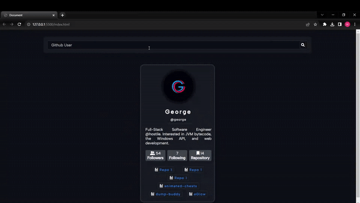

<h1>GITHUB PROFILE CARDS</h1>

This project represents an application developed using the JavaScript programming language, allowing users to browse the GitHub profiles of other users. The application displays essential information about a specific GitHub user, including their profile picture, number of followers, following count, and repository count. Users can also access the respective GitHub profiles directly through provided links.

<h2>Features</h2>

<ul>
        <li>Created using Html, Css and Javascript</li>
        <li>Full responsive</li>
        <li>GitHub user data is fetched through the GitHub API and presented to users.</li>
        <li>Different animations are used</li>
</ul>

<h2>Screen Gif</h2>

